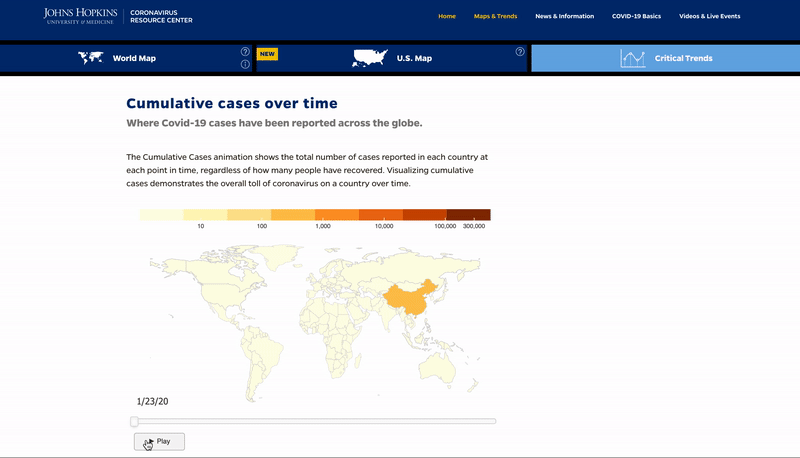

# Tracking Critical COVID-19 Data

Johns Hopkins University recently released an updated component to their [Coronavirus Resource Center website](https://coronavirus.jhu.edu/data) that showcases both critical COVID-19 data trends and an in-depth look at the most up-to-date COVID-19 confirmed case and death reports by US county. These data visualizations can help us better understand the virus's spread across countries so that we can implement data-driven prospective measures, policies, and support to help minimize the spread of the virus and better understand who might be in need of supplies or other support while there are active cases in those US counties. 

Under Critical Trends, the [Cumulative Cases Over Time ](https://coronavirus.jhu.edu/data/animated-world-map)data visualization animation shows "the total number of cases reported in each country at each point in time, regardless of how many people have recovered:"

While this helps us understand the overall toll of the virus in a country at a given time, we've seen in the US how local state and city leadership is critical to  manage the well-being of their jurisdictions by protecting and informing citizens, forming public-private partnerships, and implementing social distancing and other policies to mitigate the spread of the virus and provide additional resources for healthcare frontline staff. An animated data visualization that demonstrates the number of cumulated COVID-19 confirmed cases in US counties can help us better understand how the virus is spreading within the United States and which county and state governments, businesses, and other organizations might need support during the pandemic.

 **How can we make a similar visualization to show the overall toll on US counties or county equivalents?**

