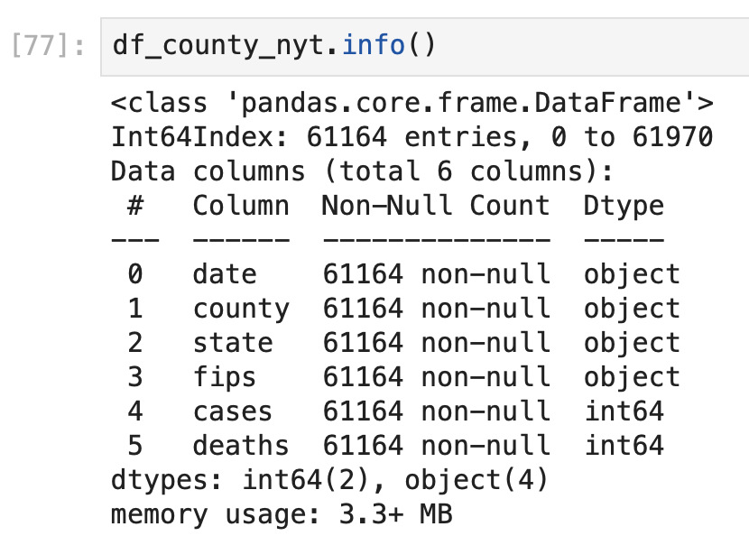
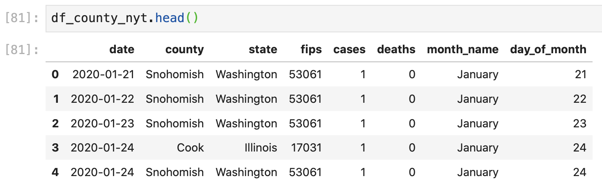
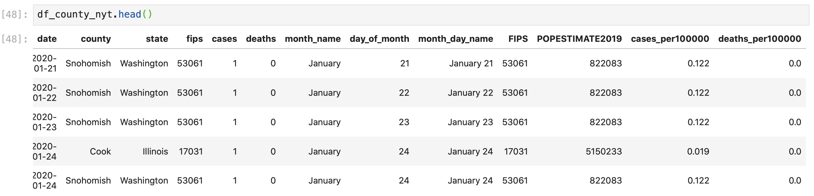

# Cleaning NYT COVID-19 US County Data

The NYT COVID-19 data is almost already formatted correctly for our Plotly Express parameters, but we'll do a little data cleaning to make sure that our graph and hover data is readable and easy to understand for anyone who uses our map.

### Reformat FIPS County Codes

First, we'll save the data in the "fips" column as a 5-digit string \(it's currently a float format\) in the exact same way that we've done this for our other data frames so that the data in our dataframe accurately merges with the data in the "id" fields of our GeoJSON file. Since we've written a version of this code several times, it might be worth our time to write our own personalized function to clean and edit any FIPS code data in future data sets so we don't need to copy and paste this code each time we want to edit the dataframe. For now, we'll copy and paste the code to quickly create a choropleth map, but know that there is an easier way to format data, which we'll review next week with Baltimore City Salary Data.

Reformat the "fips" code column by: 

1. Removing any null values in the FIPS code column
2. Converting the column values to integers to remove the float decimals
3. Converting the column values to strings so that we can add preceding zeros
4. Adding preceding zeros to the FIPS codes so that each value is 5 digits long

```python
# convert fips to an integer then string then forward fill 0s to get 5 digits

#remove null values
df_county_nyt = df_county_nyt[df_county_nyt["fips"].notnull()]
# edit datatypes
df_county_nyt["fips"] = df_county_nyt["fips"].astype(int)
df_county_nyt["fips"] = df_county_nyt["fips"].astype(str)
df_county_nyt["fips"] = df_county_nyt["fips"].str.zfill(5)
```

### Add Date and Month Name Column

Now, we'll create a new column that contains the month and day name \(instead of the number\) so that we can easily read the date for each frame in our choropleth map.

If we look at the data types in our data frame, we see that the date column is a string instead of a datetime data type: 



To extract the month and date from the date column, we'll first convert the "date" column to a date time format:

```python
# convert date column to datetime
df_county_nyt["date"] = pd.to_datetime(df_county_nyt["date"])
```

Here we redefine the "date" column in our NYT data frame \(`df_county_nyt["date"] =` \) as the values in the same column and dataframe \(`df_county_nyt["date"]`\), converted to datetime data types \(`.to_datetime()`\) using this function in pandas \(`pd`\).

Now that we redefined the data types in a datetime format, we can extract date \(and time\) data into different columns. First, we'll make a new column that contains the month name of the date from the date column: 

```python
# make column with month name
df_county_nyt["month_name"] = df_county_nyt["date"].dt.month_name()
```

Here we use the datetime function \(`.dt`\) to extract the month name \(`.month_name()`\) from the date column in our dataframe \(`df_county_nyt["date"]`\) into a new column named "month\_name" \(`df_county_nyt["month_name"] =`\).

We'll use similar code to create a new column that contains the day of the month: 

```python
# make column with month day
df_county_nyt["day_of_month"] = df_county_nyt["date"].dt.day
```

Here we use the datetime function \(`.dt`\) to extract the day of the month \(`.day`\) from the date column in our dataframe \(`df_county_nyt["date"]`\) into a new column named "month\_name" \(`df_county_nyt["day_of_month"] =`\).

If we preview our data frame we see our new columns: 



To easily access the month day and name as hover and display data in our choropleth map, we'll combine these values in a single column:

```python
# combine month and day into a string
df_county_nyt["month_day_name"] = df_county_nyt["month_name"] + " " + df_county_nyt["day_of_month"].astype(str)
```

Where we add the space \(`" "`\) so that the number doesn't appear immediately after the month name in our combined string. This gives us: 


### Create Columns for Cases and Deaths per 1,000 County Residents

Before we can plot this data in a choropleth map, we want to include two more columns that lists the number of cases or deaths per 1,000 people in each county, so that our choropleth color shadings represent a more standardized view of to compare data across counties. If we only include the case numbers in our choropleth map, then the color variations might better represent the population values rather than the overall toll of the virus on any given population.

To do this, we'll need to merge the population data that we formatted earlier onto our NYT dataframe: 

```python
# merge 2019 population data onto nyt covid-19 df
df_county_nyt = pd.merge(df_county_nyt,
                         df_countypop[["FIPS","POPESTIMATE2019"]],
                         left_on = "fips",
                         right_on = "FIPS",
                         how = "left")
```

The left merge is important here since we want to keep all of the values from our NYT COVID-19 dataframe in the same order, and then repeat the FIPS code and population estimate values as necessary.

Now, we can create two columns that represent the number of cases per 1,000 county residents and number of deaths per 100,000 residents, and round each value to 3 decimal places: 

```python
# make columns to calculate number of cases and deaths per 100000 residents
# round the values to the 3rd decimal

df_county_nyt["cases_per100000"] = round(((df_county_nyt["cases"]/df_county_nyt["POPESTIMATE2019"])*100000),3)
df_county_nyt["deaths_per100000"] = round(((df_county_nyt["deaths"]/df_county_nyt["POPESTIMATE2019"])*100000),3)
```

This gives us this dataframe: 



Now we can plug our column parameters into the choropleth map plotly express template to create our animation.


### 

