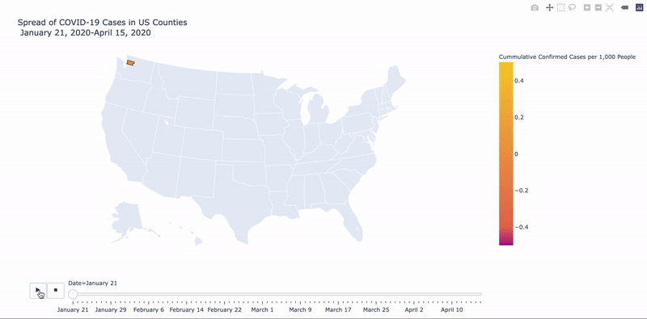
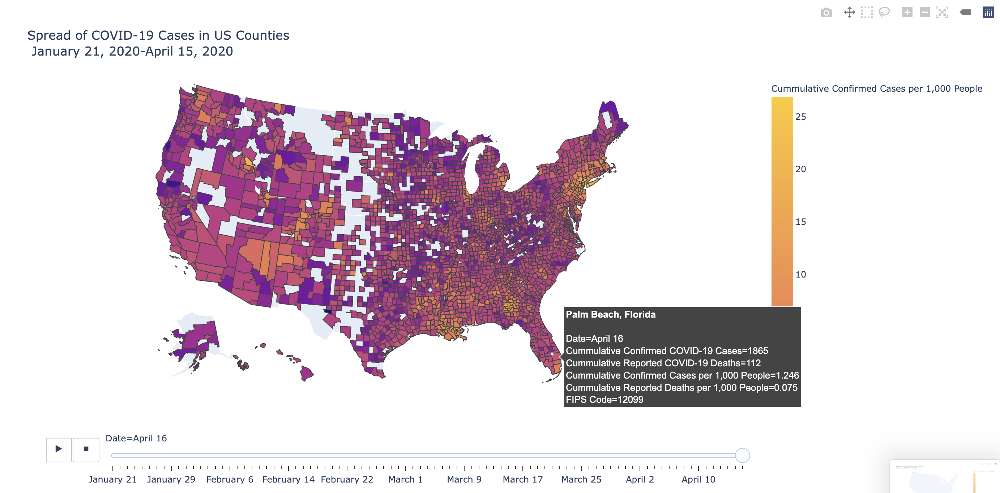

# Making an Animated Choropleth Map with COVID-19 Case Data

Before we can input our parameters to make an animated choropleth graph, we need to define the color scale for our choropleth. Although [plotly has several built-in color scales](https://plotly.com/python/builtin-colorscales/) to incorporate into our graphs, these won't be a good way to demonstrate our data since the number of cases and deaths increases at an exponential rate, [as we found in our previous analysis](https://colab.research.google.com/drive/1zClEc4YwwmQcxYKtTVT5YgqHVKn2GSqJ). 

### Defining a Logarithmic Color Scale

To define a color scale that matches an exponential growth pattern, we'll use the colors from one of plotly's built-in color scales \(Plasma\) to make our own color scale that changes at an exponential rate.

We're going to use only 5 different colors for our continuous color scale, but plotly's color scales use 7 different colors. To print the HEX codes that define the colors in the Plasma color scale we'll write: 

```python
print(px.colors.sequential.Plasma)
```

Which returns: 

```text
['#0d0887', '#46039f', '#7201a8', '#9c179e', '#bd3786', '#d8576b', '#ed7953', '#fb9f3a', '#fdca26', '#f0f921']
```

in line in our notebook. If we look at _**Plasma**_ in the [built-in sequential color scales](https://plotly.com/python/builtin-colorscales/#builtin-sequential-color-scales), we can also reveal the HEX code for each color as we hover over each color. We'll use every other color in this scale to represent a similar distribution of colors, but redefine the scale to change on a logarithmic scale:

```python
# make a logai=rithmic color scale
covid_colorscale = [
        [0, '#0d0887'],       #0 cases
        [1./1000, '#7201a8'], #10 cases
        [1./100, '#bd3786'],  #100 cases
        [1./10, '#ed7953'],   #1000 cases
        [1., '#fdca26'],      #10000 cases
]
```

Here, we define a new color scale \(`covid_colorscale`\) that changes colors \(`'#0d0887'`, `'#7201a8'`, `'#bd3786'`, `'#ed7953'`, `'#fdca26'`\) on a logarithmic scale instead of an equally distributed scale. 

### Building the Animation

 All of the potential parameters for this map are available [here](https://plotly.github.io/plotly.py-docs/generated/plotly.express.choropleth.html), but we're mainly concerned with the following parameters in our **choropleth template** for this map:

```python
#TEMPLATE for Plotly Express Choropleth Map:

choropleth_animation = px.choropleth(df, # dataframe with data for choropleth
                                    geojson= name_of_geojson_data, # shape, geospatial data geojson
                                    locations='"column" in geojson that denotes the shapes', 
                                    color='column in df that contains values that define the color scale',
                                    animation_group = "column in df that changes with each animation frame",
                                    animation_frame = "column in df that identifies each animation frame",
                                    hover_name = "column in df that shows up in bold in the hover square",
                                    color_continuous_scale= name_of_colorscale, 
                                    scope="usa", # scope of map (world, USA, or any continent)
                                    labels = {"column name": "what you'd like to rename the column to",
                                         "column name": "what you'd like to rename the column to"
                                        }, # these are optional, but usually make for nicer data presenation
                                    title = "Title of Map"
                                          
                          )
```

Which results in this code to create the choropleth animated map: 

```python
# make a map of covid cases on april 14, 2020
covid_uscounty_color = px.choropleth(df_county_nyt, # dataframe with data for choropleth
                                     geojson=us_counties_shape, # shape, geospatial data geojson
                                     locations='fips', # column in geojson that denotes the shapes
                                     color='cases_per100000', # column in df that denotes the color scale
                                     animation_group = "month_day_name",
                                     animation_frame = "month_day_name",
                                     hover_name = df_county_nyt["county"] + ", " + df_county_nyt["state"],
                                     hover_data = ["cases", "deaths", "cases_per1000", "deaths_per100000"],
                                     color_continuous_scale=covid_colorscale, # custom color scale to better show exponential growth
                                     scope="usa", # scope of map (world, USA, or any continent)
                                     labels={'cases':'Cummulative Reported COVID-19 Cases',
                                             "deaths": "Cummulative Reported COVID-19 Deaths",
                                             "month_day_name": "Date",
                                             "fips": "FIPS Code",
                                            "cases_per100000": "Cummulative Reported Cases per 100,000 People",
                                             "deaths_per100000": "Cummulative Reported Deaths per 100,000 People"
                                            }, # renaming any columns used
                                     title = "Spread of COVID-19 Cases in US Counties Per Capita<br>January 21, 2020-April 15, 2020"
                                          
                          )
```

Here:

* **`df_county_nyt`** is the dataframe that contains the values we want to include in our choropleth map
* **`us_counties_shape`** is the GeoJSON file that we saved earlier, which contains the shape file information for the US counties
* **`fips`** is the column in the dataframe that matches the **`"id"`** value in our GeoJSON file which allows us to use the color parameter to define the color values
* **`cases_per_100000`** defines the column values that dictate the color shading within our choropleth map
* **`month_day_name`** identifies the values in the data frame that change with each animation "frame"
* **`df_county_nyt["county"] + ", " + df_county_nyt["state"]`** means that we combine the values in the county and state columns to include as bolded values in our hover text
* **`["cases", "deaths", "cases_per100000", "deaths_per100000"]`** is a list of columns that contain values that we want to display in the hover squares
* **`covid_colorscale`** is our custom logarithmic color scale
* **`"usa"`** means that our map will show only the map of the USA
* the **`labels`** redefine the presentation of the column headers as more informative text where the values in quotes before the colon are the actual column names and the values in quotes after the colon are the "new" values that show up in our map
* **`"Spread of COVID-19 Cases in US Counties <br>January 21, 2020-April 15, 2020"`** defines the map title, and includes a break \(`<br>,` or second line of text\) before the date range

This is a pretty large map file, so, again, we'll save this as an html file with:

```python
# export animation to html
covid_uscounty_color.write_html("covid19_cases_us_county.html")
```

Which will download to our working folder. When we open this file we'll see the animated choropleth map that shows the spread of COVID-19 cases when we click the play button: 



Where we can also hover over each county's shape to get additional information about that county:



**We standardized the data to shade our choropleth map so that we could better compare the toll on different counties with each other, but what does the choropleth map look like if we used the raw case data instead of the standardized data? Why would we not want to use the raw data in this visualization?**


