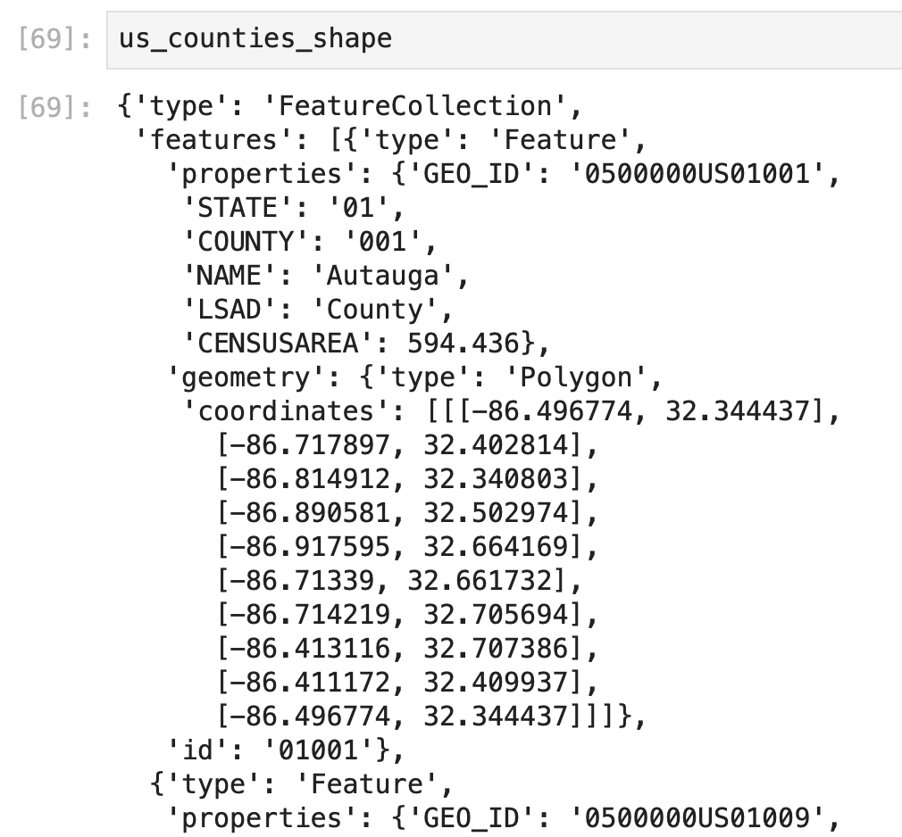
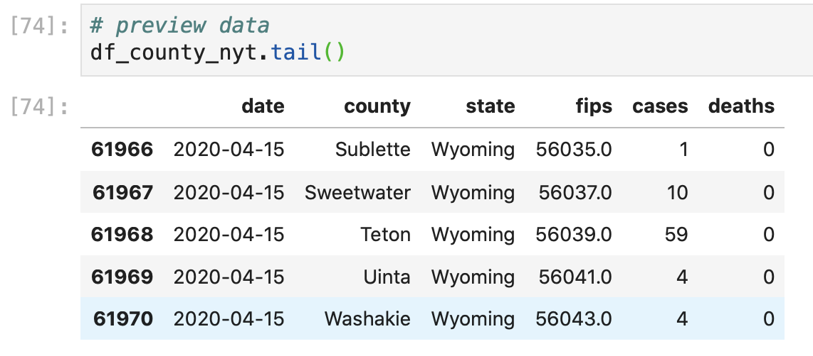

# Making an Animated Data Visualization to Show the Cumulative Cases Over Time in US Counties

While the bubble and heat maps are useful to understand the toll of the novel coronavirus at any given point in time, it might also be useful to understand how the virus is spreading within the US so that we can see how different governments and businesses have coped with  a growing burden effectively, and so that we can identify regions that might be overburdened. 

To do this, we'll create an animate choropleth map that shows the cumulative number of confirmed COVID-19 cases on each day since the first reported cases in the United States. To make a choropleth graph, we'll need both geographic shape data and data values to shade the geographic shapes.

Plotly express requires a specific type of geographic file to make our visualization called a GeoJSON file, which is another type of file structure \(similar to how CSV is a file structure\). We can access a GeoJSON file of US County shapes similarly to how we access CSV files from GitHub: through a link available [here](https://raw.githubusercontent.com/plotly/datasets/master/geojson-counties-fips.json). 

Although the data in the JHU CSSE repository contains all of the information that we need for this choropleth map, this data is all reported in individual CSV files for each day's updated reporting. While we can combine all of the data in the data sets, the data from the [NYT GitHub repository](https://github.com/nytimes/covid-19-data) is already formatted as one continuous data set that is also formatted in a useful way to use with plotly express, so we'll use this CSV for our animated choropleth map.

### Upload Geographic \(US County\) Shape Data

We've already imported the two additional libraries to help load in our GeoJSON file \(`urlopen` and `json`\), so we'll use these to upload our shape files of US counties: 

```python
# save geojson file in our notebook
with urlopen('https://raw.githubusercontent.com/plotly/datasets/master/geojson-counties-fips.json') as response:
    us_counties_shape = json.load(response)
```

Here, we're loading in the GeoJSON file from the website link, and saving the GeoJSON shape data as a new variable \(`us_counties_shape`\) that we'll be able to call upon in our code for our map.

The JSON file structure looks like this: 



Where each "row" is enclosed with `{}`, each "column" is listed in quotes on the left side of the colon, the "column values" are listed in quotes on the right side of the colon, and columns and rows are separated by commas. This GeoJSON is specifically formatted for plotly express to contain data features, geometry data, and a feature `id`. Remember that the geometry polygon data is a [shape on a map made up of different latitude and longitude coordinates](https://docs.google.com/presentation/d/1LP01PkbredAjIF4jMt7VZHnrizymJpPhaXoI5r81TkE/edit?usp=sharing). It's not important now to understand the intricacies of the GeoJSON format, but you should recognize the data contained within the file. 

### Upload NYT COVID-19 Data

We'll upload the NYT COVID-19 data in the same way that we uploaded this data to a previous notebook: 

First, by saving the Raw CSV link: 

```python
# upload the nyt covid-19 data
covid_nyt_data = "https://raw.githubusercontent.com/nytimes/covid-19-data/master/us-counties.csv"
```

Then, by saving the data as a pandas data frame: 

```python
# make data into a dataframe
df_county_nyt = pd.read_csv(covid_nyt_data)
```

If we preview the end of our NYT data frame, we can see that this gives us data until April 15, 2020:




