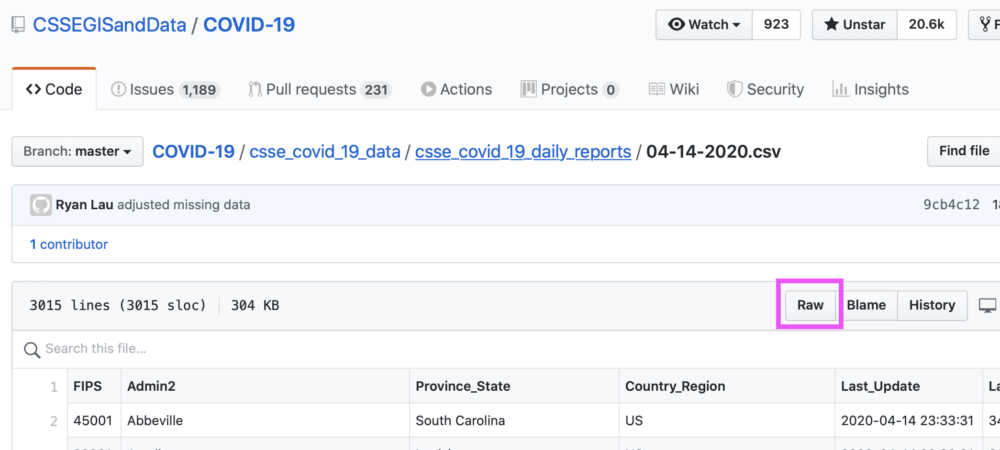
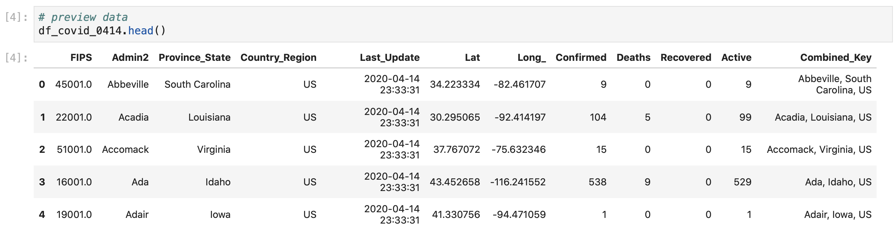
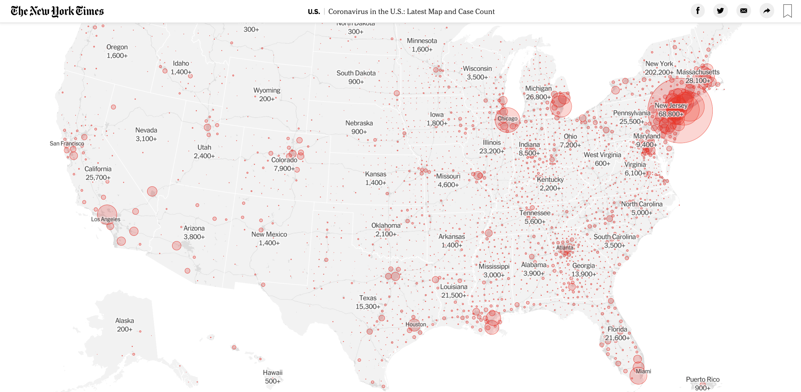
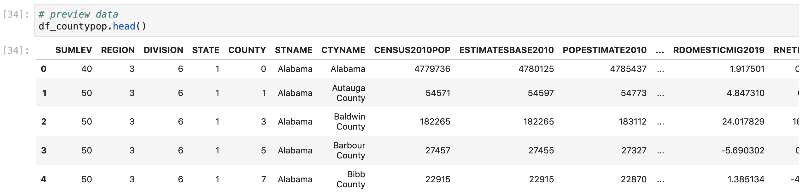
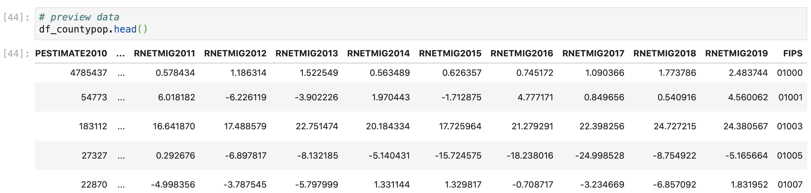
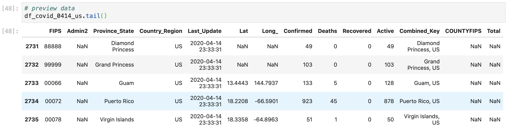
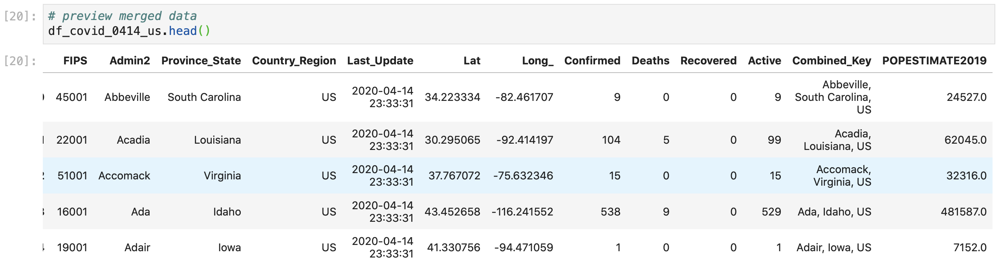
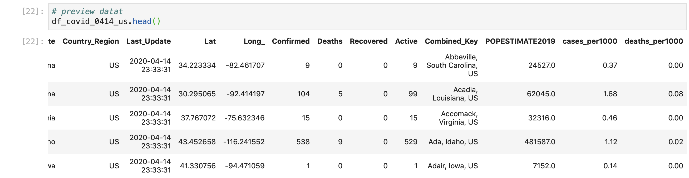
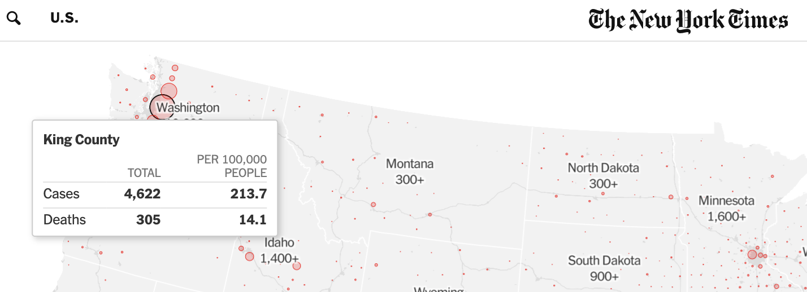

# Cleaning JHU CSSE COVID-19 Data

Launch JupyterLab from your Anaconda homepage, follow along with the tutorial, and copy and paste the code in the code blocks into your notebook's cells to perform the analysis.

### Import Packages

Before we can work with our data, we'll need to import two packages to help with our data analysis \(`pandas`\) and data visualization \(`plotly.express`\), and two packages to create choropleth maps \(`urlopen` and `json`\):

```python
# import packages
import pandas as pd
import plotly.express as px

# import libraries to access geojson file (for animated choropleth map)
from urllib.request import urlopen
import json
```

### Import Data

Since the JHU CSSE publishes their data on GitHub in csv formats, we can import the COVID-19 case data directly from their [COVID-19 repository](https://github.com/CSSEGISandData/COVID-19) \(in the folder containing the daily report data from April 14, 2020 in the following path: [csse\_covid\_19\_data](https://github.com/CSSEGISandData/COVID-19/tree/master/csse_covid_19_data)/[csse\_covid\_19\_daily\_reports](https://github.com/CSSEGISandData/COVID-19/tree/master/csse_covid_19_data/csse_covid_19_daily_reports)/[**04-14-2020.csv**](https://github.com/CSSEGISandData/COVID-19/blob/master/csse_covid_19_data/csse_covid_19_daily_reports/04-14-2020.csv)\). To work with the data in our notebook, we'll click on the Raw button:



to access a link to our data in a csv format. Save this data as a variable in our notebook:

```python
# data from JHU CSSE
data_covid = "https://raw.githubusercontent.com/CSSEGISandData/COVID-19/master/csse_covid_19_data/csse_covid_19_daily_reports/04-14-2020.csv"
```

Then import this data as a dataframe in our notebook using the `pandas.read_csv()` function: 

```python
# make dataframe
df_covid_0414 = pd.read_csv(data_covid)
```

If we preview our data with `df_covid_0414.head()`, we see that our data looks like: 



We see a lot of familiar information in this dataframe \(FIPS codes, county and state names and unique identifiers, and confirmed cases, deaths, and active COVID-19 cases\). This dataframe also gives us the latitude and longitude coordinates for each county, which allows us to plot our data on a geographic plane \(a map\). Even though there are some other types of [geographical coordinate systems](http://help.arcgis.com/en/sdk/10.0/arcobjects_net/conceptualhelp/index.html#//0001000002mq000000), these latitude and longitude coordinates \(global coordinate system/GCS\) are formatted correctly for our analysis with plotly and mapbox. If you import data that has other kinds of coordinates, you may need to convert them to the GCS or some other coordinate system before you can plot or map the data. 

### Cleaning Data

The JHU CSSE dataset is pretty clean and tidy for us to pretty quickly build into a map that looks like the the New York Times' [Latest Map and Case Count](https://www.nytimes.com/interactive/2020/us/coronavirus-us-cases.html):



First, we'll cut the JHU data to include only US counties with: 

```python
# keep only US data
df_covid_0414_us = df_covid_0414[df_covid_0414["Country_Region"]== "US"]
```

Then, we want to merge the county population numbers into this dataset so that we can standardize the number of coronavirus cases per 1,000 people, instead of reporting the raw numbers. Standardizing the data can help us compare the burden on different cities, whereas reporting raw numbers may be more reflective of total population.

We'll first import US Census Data on the estimated 2019 county populations, which you can download [here](https://www.census.gov/data/datasets/time-series/demo/popest/2010s-counties-total.html), or upload directly from the US Census link, similar to how we imported our COVID-19 data:

```python
# save csv data from us census population
data_population = "https://www2.census.gov/programs-surveys/popest/datasets/2010-2019/counties/totals/co-est2019-alldata.csv"
```

```python
# import county population total data from 2019
df_countypop = pd.read_csv(data_population,encoding='latin1')
```

Which creates: 



To merge the county FIPS code onto our JHU CSSE dataframe, we need to:

* Create a county FIPS code column in our population data
* Convert the FIPS code column in the JHU COVID-19 dataframe to a string and fill in preceding 0s
* merge the dataframes together on the FIPS code column

We'll create the FIPS code column in our population dataset similarly to how we created a [FIPS code column with our geographic data](https://app.gitbook.com/@melanieshimano/s/merging-data-and-plotly-visualizations/editing-geographic-state-and-county-data) last week by converting the columns into string data types \(from integer data types\):

```python
# convert state and county columns to strings
df_countypop["STATE"] = df_countypop["STATE"].astype(str)
df_countypop["COUNTY"] = df_countypop["COUNTY"].astype(str)
```

Filling in preceding zeros so that the STATE column has two digits and the COUNTY column has three digits:

```python
# fill in preceding zeros to make state 2 digits and county 3 digits
df_countypop["STATE"] = df_countypop["STATE"].str.zfill(2)
df_countypop["COUNTY"] = df_countypop["COUNTY"].str.zfill(3)
```

Then creating a new "FIPS" column that contains the full county FIPS code, which combines the state and county FIPS codes: 

```python
# sum state and county FIPS to create a column that contains the full county fips code
df_countypop["FIPS"] = df_countypop["STATE"] + df_countypop["COUNTY"]
```

This gives us a new FIPS column, which looks like: 



Before we can merge the data from the population dataframe onto our JHU COVID-19 dataframe, we need to remove all null values in the FIPS column:

```python
# remove null FIPS codes
df_covid_0414_us = df_covid_0414_us[df_covid_0414_us["FIPS"].notnull()]
```

Convert the FIPS column in this dataframe to a string from a float \(remember that we need to convert the number first to an integer to remove the decimal, and then to a string\):

```python
# convert JHU df FIPS to integer
df_covid_0414_us["FIPS"] = df_covid_0414_us["FIPS"].astype(int)
df_covid_0414_us["FIPS"] = df_covid_0414_us["FIPS"].astype(str)
```

Then, add preceding zeros to make the FIPS code five digits long: 

```python
# fill in preceding zeros to make FIPS five digits
df_covid_0414_us["FIPS"] = df_covid_0414_us["FIPS"].str.zfill(5)
```

This gives us:



### Merging Data

Now, we can merge the population data onto our COVID-19 case data with code similar to what we used last week to merge population, hospital, and geographic data together. We'll use `pd.merge` to add only the 2019 population data column onto our COVID-19 case data: 

```python
# merge 2019 population data onto covid-19 df
df_covid_0414_us = pd.merge(df_covid_0414_us,
                           df_countypop[["FIPS","POPESTIMATE2019"]],
                           on = "FIPS",
                           how = "left")
```

Which gives us the following dataframe:



Now, we can create a column to calculate the number of COVID-19 cases and deaths per 1,000 people:

```python
# make column for number of cases per 1000 people and deaths per 1000 people
df_covid_0414_us["cases_per1000"] = (df_covid_0414_us["Confirmed"]/df_covid_0414_us["POPESTIMATE2019"])*1000
df_covid_0414_us["deaths_per1000"] = (df_covid_0414_us["Deaths"]/df_covid_0414_us["POPESTIMATE2019"])*1000
```

Since these per capita values have long decimal tails, we'll round the values to the second decimal place so that they show up cleaner on our hover data:

```python
# round per capita values
df_covid_0414_us["cases_per1000"] = round(df_covid_0414_us["cases_per1000"], 2)
df_covid_0414_us["deaths_per1000"] = round(df_covid_0414_us["deaths_per1000"], 2)
```

Here, we redefine the per capita columns in our dataframe \(`df_covid_0414_us["cases_per1000"]` and `df_covid_0414_us["deaths_per1000"]`\) as their same values \(`df_covid_0414_us["cases_per1000"]` and `df_covid_0414_us["deaths_per1000"]`\), except rounded \(`round()`\) to the second decimal place \(`2`\). This gives us this dataframe: 



Now we have all of the data to make a bubble map similar to the NYT Total COVID-19 Cases per US County:




 


