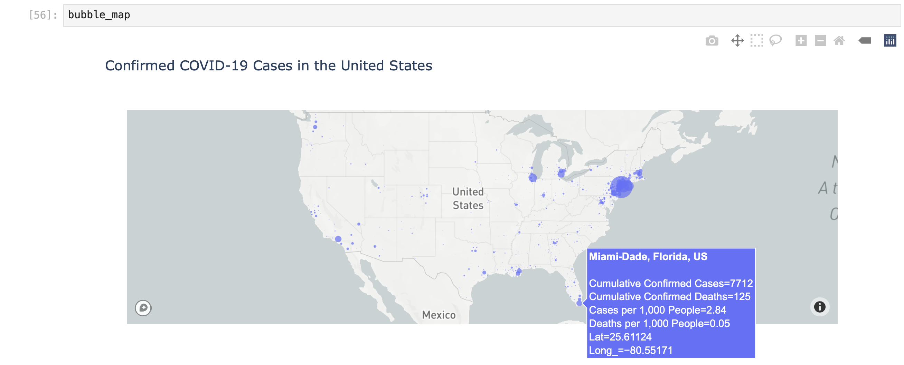

# Making a Bubble Map of Cumulative COVID-19 Confirmed Cases as of April 14, 2020

We'll use a similar plotly express template to previous analysis to build our bubble map of cumulative confirmed COVID-19 cases in US counties, where the radius of the bubble corresponds to the number of cumulative confirmed COVID-19 cases in US counties. All of the potential parameters for this map are available [here](https://plotly.github.io/plotly.py-docs/generated/plotly.express.scatter_mapbox.html#plotly.express.scatter_mapbox), but we're mainly concerned with the following for this map:

```text
# TEMPLATE for bubble map
bubble_map = px.scatter_mapbox(df, # name of dataframe with data for bubble chart on the map
                               lat = "column of latitude values",
                               lon = "column of longitude values",
                               size = "column with values that dictates the bubble size",
                               hover_data = [list of columns that you want to display on the hover] ,
                               hover_name = "column with additional data that you want bolded in the hover pop-up",
                               center = dict(lat=latitude coord for center of map, S is negative, 
                                            lon= longitude coord for center of map, W is negative),
                               zoom = number for how much you want to zoom into the center of the map,
                               title = "Title of Map",
                               labels = {"column name": "what you'd like to rename the column to",
                                         "column name": "what you'd like to rename the column to"
                                        } # these are optional, but usually make for nicer data presenation
                              )

```

Plotly Express uses mapbox to create the bubble chart maps, so we'll need to first define and set the Mapbox token for this graph. To do this you'll need to log into your Mapbox account \(or make a free Mapbox account if you don't already have one\) and click on your **Account** menu \(under the astronaut icon in the top, right corner: 


Then copy either your default Public Access Token, or create a new one:


Since you are only allotted a certain number of requests to use the Mapbox access token \(e.g. to use Mapbox's mapping functionality in your code\), you don't want to share your Mapbox access tokens with anyone, or publish this in your code on GitHub or elsewhere. There are ways to import access tokens and other private information so that you don't need to remember to redact this information if you share or publish your code. However, for now, we'll copy and paste our Mapbox tokens directly into the code **but make sure to remove this line from your notebook before you upload the notebook files to GitHub.** To enter our access tokens, we'll write: 

```python
# set up mapbox access token
px.set_mapbox_access_token("mapbox_token")
```

Where you replace `".mapbox_token"` with your actual access token in quotes.

We'll use this to input our own dataframe and column information to make our bubble map with:

```text
# bubble map of number of cases
bubble_map = px.scatter_mapbox(df_covid_0414_us, 
                               lat = "Lat",
                               lon = "Long_",
                               size = "Confirmed",
                               hover_data = ["Confirmed", "Deaths", "cases_per1000", "deaths_per1000"] ,
                               hover_name = "Combined_Key",
                               center = dict(lat=37.0902, 
                                            lon= -95.7129), # center of the US
                               zoom = 2.5,
                               title = "Confirmed COVID-19 Cases in the United States",
                               labels = {"Confirmed": "Cumulative Confirmed Cases",
                                         "Deaths": "Cumulative Confirmed Deaths",
                                         "cases_per1000": "Cases per 1,000 People",
                                         "deaths_per1000": "Deaths per 1,000 People"
                                        } 
                              )
```

Here: 

* **`df_covid_0414_us`**  is the dataframe that contains the data for our map
* **`"Lat"`** is the column name in **`df_covid_0414_us`** that contains the county's latitude coordinate
* **`"Long_"`** is the column name in **`df_covid_0414_us`**that contains the county's longitude coordinate
* **`"Confirmed`"** is the column name for the values that we want to determine the size of the bubble chart bubbles \(number of cumulative confirmed cases\)
* **`["Confirmed", "Deaths", "cases_per1000", "deaths_per1000"]`** are names of columns that contain data that we want to show up on our hover pop-up squares
* **`"Combined_Key"`** is the column name that contains values we want to show up in bolded text in our hover pop-up squares \(contains the county name and state name\)
* **`center = dict(lat=37.0902, lon= -95.7129)`** defines the center of the map at the coordinates of the US \(37.0902 N, 95.7129 W\)
* **`zoom`**  defines how much we want to zoom into the center of the defined center coordinates \(you can play around with different numbers to see how this changes the map view\)
* **`"Confirmed COVID-19 Cases in the United States"`** is the title of our map
* the **`labels`** redefines how the names of the columns show up on our map, where the name on the left side of the colon is the name as is appears as a column header, and the name on the right side of the colon is the name that we'd like to display on our map

This gives us an interactive chart that looks like: 



Where we can hover over each bubble to view county-specific data.

 

\`


