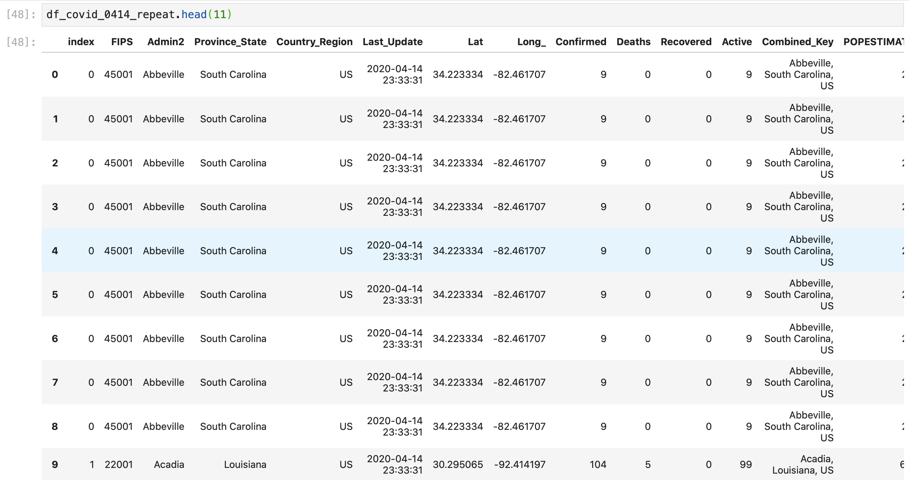
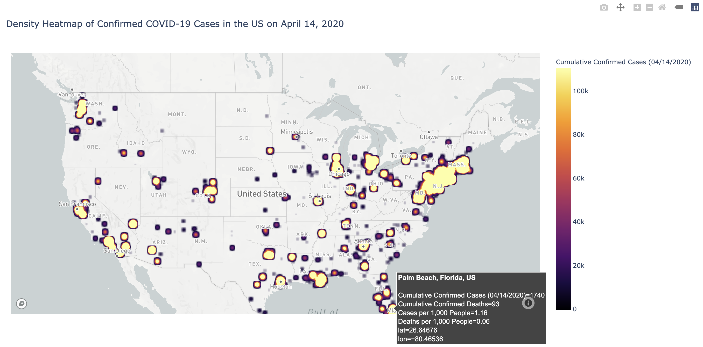

# Making a Density Heat Map of Cumulative COVID-19 Confirmed Cases as of April 14, 2020

We can use a similar data visualization template to create a density heat map with the same data to view the number of confirmed COVID-19 cases in the US. All of the potential parameters for this map are available [here](https://plotly.github.io/plotly.py-docs/generated/plotly.express.density_heatmap.html#plotly.express.density_heatmap), but we're mainly concerned with the following parameters in this _**map code template**_:

```text
density_heatmap = px.density_mapbox(df, # dataframe with data for the heatmap 
                                    lat= "column of latitude values", 
                                    lon= "column of longitude values", 
                                    z= "column of values that are the density values", 
                                    hover_data = [list of columns that you want to display on the hover] ,
                                    hover_name = "column with additional data that you want bolded in the hover pop-up", 
                                    labels = {"column name": "what you'd like to rename the column to",
                                         "column name": "what you'd like to rename the column to"
                                        } # these are optional, but usually make for nicer data presenation 
                                    color_continuous_scale= name of colorscale for heatmap,
                                    center = dict(lat=latitude coord for center of map, S is negative, 
                                            lon= longitude coord for center of map, W is negative),
                                    zoom = number for how much you want to zoom into the center of the map,
                                    title = "Title of Map",
                                    radius = Number that sets the radius of influence of each point (default is 30),
                                    histfunc = function used to aggregate z values ('count', 'sum', 'avg', 'min', or 'max'))
```

The density heat map plots each point \(by latitude and longitude coordinates\) onto a map and shows the density of the points through a pre-defined color range. We want to create a density heat map that shows the density of COVID-19 cases in the United states based on the cases reported per county, but our data frame only contains a column with the number of cases per county or lat/long point. If we plotted this data frame as a heat map, then our density would only show the density of reporting cities on April 14, 2020. 

To create an estimated density map for the number of cases reported in the US, we need to make a data frame that has a row/data point for each reported COVID-19 case. We can do this by defining a data frame that contains a repeating rows with the county's latitude, longitude, and name equal to the number of cases reported at this time. For example, if a county had 10 reported COVID-19 cases, our data frame would list that county 10 times in the data frame. To make this data frame we'll write: 

```python
# copy row and append row equal to the number of cases for that county
df_covid_0414_repeat = df_covid_0414_us.reindex(df_covid_0414_us.index.repeat(df_covid_0414_us["Confirmed"])).reset_index()
```

Here, we redefine a new data frame \(`df_covid_0414_repeat =`\) where we are editing the index/row labels of our previous data frame \(`df_covid_0414_us.reindex`\) by repeating values \(`.repeat`\) of our data frame rows \(`df_covid_0414_us.index`\) a number of times equal to the value in the confirmed COVID-19 case column \(`(df_covid_0414_us["Confirmed"])`\). Then we reset the row labels \(`.reset_index()`\) so that our row labels correspond to the correct row numbers. This gives us: 



where we can see that the row for Abbeville, South Carolina is repeated 9 times since the value in the Confirmed column is 9. 

Before we plot this, we'll rename the latitude and longitude columns as "lat" and "lon" in case we want to upload this to Mapbox later to create non-coded heat map:

```python
# rename Long_ column to long and Lat column to lat to upload to mapbox
df_covid_0414_repeat = df_covid_0414_repeat.rename(columns = {"Lat": "lat",
                                                                     "Long_": "lon"})
```

To plot this in a density heat map with plotly express, we'll use the template in the code block above with data from our repeat data frame: 

```text
density_heatmap = px.density_mapbox(df_covid_0414_repeat, # dataframe with data for the heatmap 
                                    lat = "lat", 
                                    lon = "lon", 
                                    z = "Confirmed", 
                                    hover_data = ["Confirmed", "Deaths", "cases_per1000", "deaths_per1000"],
                                    hover_name = "Combined_Key",
                                    center = dict(lat=37.0902, 
                                                  lon= -95.7129), # center of the US
                                    zoom = 2.5, 
                                    labels = {"Confirmed": "Cumulative Confirmed Cases",
                                         "Deaths": "Cumulative Confirmed Deaths",
                                         "cases_per1000": "Cases per 1,000 People",
                                         "deaths_per1000": "Deaths per 1,000 People"
                                        }, 
                                    color_continuous_scale= "Inferno",
                                    title = "Density Heatmap of Confirmed COVID-19 Cases in the US",
                                    radius = 25,
                                   )
```

Since our repeat data frame is pretty large, if we view this data frame in our JupyterLab notebook, the notebook might crash under default settings. Instead of viewing the heat map in line in our notebook, we'll export it as an html file and then view the final visual in a browser: 

```python
# instead, we can view if we export as an html
density_heatmap.write_html("density_heatmap_covid19_april14.html")
```

This gives us a map that looks like: 



Which might give us a better understanding of regional hotspots, which still contains the same information as our bubble chart \(since we're using essentially the same data frame to create the map\).


